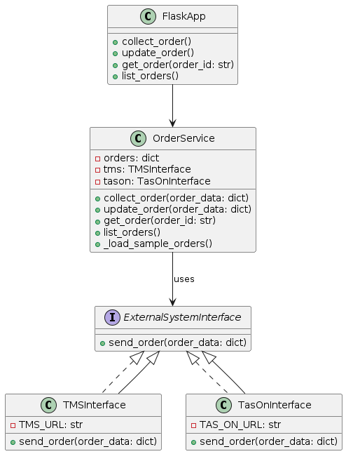

# 주문 데이터 연동 인터페이스 설계

## 개요

- 외부 시스템에서 주문 데이터를 가져와 저장하고, 내부 데이터를 외부로 전송하는 기능을 제공하는 주문 관리 시스템 설계
- 외부시스템과의 데이터 연동을 위한 인터페이스 구현

## 주문 관리 시스템과 연동될 외부 시스템에 대한 가정

휴머스온의 빅데이터 마케팅 플랫폼 **TasOn**과 연동되어 개인화된 마케팅 캠페인으로부터 유입되는 주문 데이터를 통합 관리하는 상황과 통합 메시징 솔루션 **TMS**와 연동되어 주문의 처리 상태를 추적할 수 있도록 연동되는 상황을 외부 시스템으로 가정합니다.

### 1. **시나리오 개요**

- 주문은 데이터 무결성을 위해 주문 트랜잭션 시스템에서 처리합니다.
- 주문 관리시스템은 트랜잭션이 생기거나 주문 테이블에 변동사항이 생길 때마다 데이터를 가져와 인메모리 및 sqllite에 저장합니다.
- 주문 관리시스템에 새로운 주문이 생기거나 주문의 상태가 변경될 경우 외부 시스템인 tms가 데이터를 가져갈 수 있도록 인터페이스를 제공합니다.
- 개인화 마케팅이 진행되고 그에 따라 주문이 생성되는 경우 마케팅별로 주문을 확인할 수 있도록 인터페이스를 제공합니다.

### 2. **시스템 구성 및 설계**

- **주문 시스템**: 주문 생성, 취소, 업데이트 등 트랜잭션 처리를 담당합니다. 
- **주문 관리 시스템**: 고객의 주문 정보를 저장하고, 각 주문의 상태를 추적하며, 필요한 경우 외부 시스템에 상태를 업데이트합니다.
- **외부 시스템**: TasOn 플랫폼의 마케팅 캠페인 시스템, 통합 메시징 솔루션인 TMS 등이 주문 관리 시스템과 데이터를 연동합니다.

### 3. **프로세스 흐름**

#### 1. 주문 시스템:
- 고객의 주문 트랜잭션을 처리하고 주문을 생성하여 초기 상태를 설정합니다.
- 주문 상태가 변경될 때마다 주문 관리 시스템으로 상태 변경 정보를 전달합니다.
#### 2. 주문 관리 시스템:
- 주문 데이터를 인메모리 및 SQLite에 저장하고, 상태를 추적하여 최신 상태를 유지합니다.
- TMS와 TasOn 플랫폼에서 요청할 경우, 주문 상태나 캠페인별 주문 데이터를 제공합니다.
#### 3. 외부 시스템(TMS, TasOn):
- TMS는 주문 상태가 변경될 때 주문 관리 시스템에서 상태 업데이트를 수신하여, 고객에게 알림을 발송할 수 있습니다.
- TasOn은 주문 관리 시스템으로부터 캠페인별 주문 데이터를 수집하여 마케팅 성과 분석에 활용할 수 있습니다.

### 4. 상세 시스템 기능 및 클래스 다이어그램

* OrderService: 주문관리의 주요 기능을 제공합니다.
  - 속성
    - orders : 주문 데이터 딕셔너리 형식으로 저장
    - tms : tms와 연동 인터페이스 인스턴스
    - tason : tason과 연동 인터페이스 인스턴스
  - 메서드
    - collect_order : 새로운 주문을 수집하고 저장
    - update_order : 주문 상태를 업데이트, tms에 변경사항 전송
    - get_order : 특정 주문 Id에 해당하는 주문 정보 제공
    - list_order : 저장된 모든 주문 목록 반환

* ExternalSystemInterface: 외부 시스템에 주문 데이터를 전송하는 공통 인터페이스입니다.
  - 메서드
    - send_order: 외부 시스템에 주문 데이터를 전송

* TMSInterface: tms와의 데이터 연동을 위한 클래스입니다.

* TasOnInterface: tason과의 데이터 연동을 위한 클래스입니다.

## 주요 기능 구현
- **주문 수집 및 저장** 
기능 : 외부 주문 시스템에서 전송된 주문 데이터를 수집하여 인메모리에 저장합니다. 
설명 : collect_order 메서드를 통해 주문 데이터를 받습니다. order_id를 키로 사용하여 데이터를 저장합니다.

- **주문 상태 업데이트**:
기능 : 주문의 상태가 면경될때 tms 시스템에 알림을 전송합니다.
설명 : update_order 메서드를 사용하여 주문 상태 변경을 전송합니다.

- **외부 데이터 제공**:
기능 : 외부 시스템이 주문 관리 시스템에 요청할때 주문 상태 및 캠페인 관련 데이터를 제공할 수 있습니다.
설명 : 외부 시스템은 get_order 또는 list_orders 엔드포인트를 호출하여 주문 데이터를 받을 수 있습니다. 

- **캠페인별 주문 통계**:

